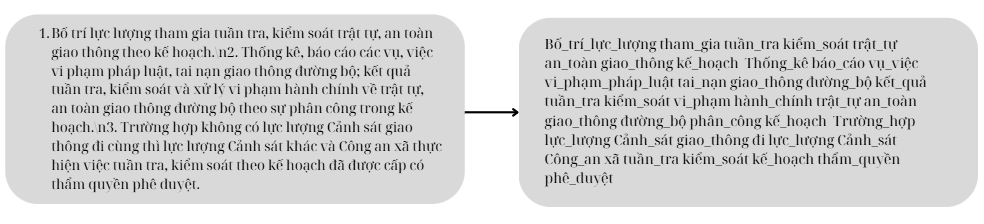
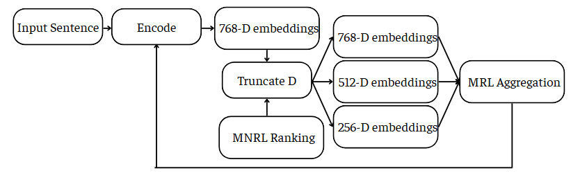
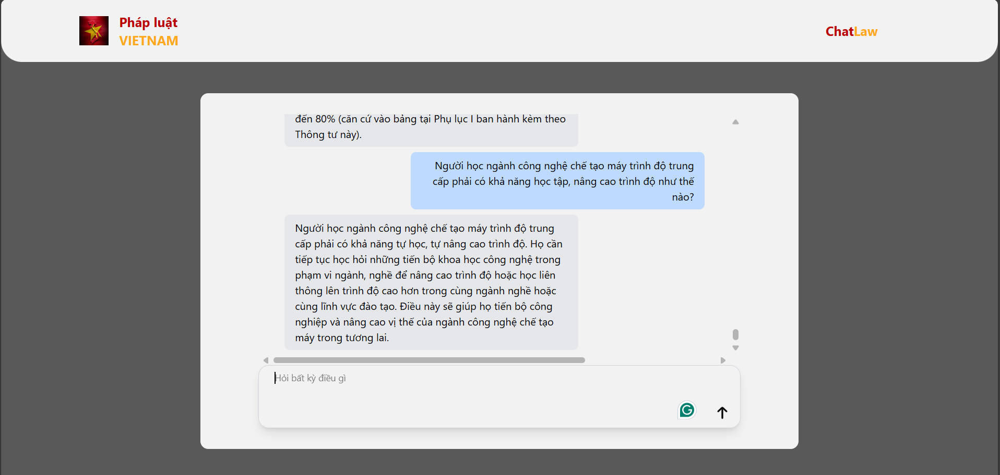

# Legal Document Retrieval
>  **AI‑powered search & chatbot that surfaces the *****exact***** legal clause you need – in seconds.**
 ---

## ✨ Highlights

- **Deep‑learning Retrieval** – Fine‑tuned *Vi‑Legal‑Bi‑Encoder‑v2* (BERT‑base, Vietnamese) with *MultipleNegativesRankingLoss* + *MatryoshkaLoss* hierarchy for strong semantics.
- **260 k+ Clause Corpus** – Cleaned and canonicalised from official statutes, decrees & circulars.
- **Lightning‑fast Index** – FAISS (IVF‑Flat + PQ) enables <40 ms average lookup on CPU.
- **Chat‑first UX** – Single‑page Flask app (REST/Streaming) that highlights clause hits and auto‑cites sources.

---

## 1  Abstract & Motivation

Finding relevant Vietnamese legal provisions is notoriously painful: tens of thousands of laws, inconsistent formatting, and ever‑changing terminology thwart traditional keyword search.  By marrying neural text embeddings with a purpose‑built web chat UI, our project bridges that gap, delivering *context‑aware* results to lawyers, SMEs, and citizens alike.  (See Final Report §1.)

---

## 2  Dataset

| File           | Purpose              | Rows    | Avg. words |
| -------------- | -------------------- | ------- | ---------- |
| **corpus.csv** | Raw legal paragraphs | 261 597 | 240        |
| **train.csv**  | Q–A pairs (labelled) | 83 619  | \~12       |
| **test.csv**   | Evaluation Q–A       | 17 919  | \~12       |

*Resource subset used in experiments*\
`corpus_after.csv` 31 053  |  `train_after.csv` 50 000  |  `test_after.csv` 8 274 


---

## 3  Pre‑processing Pipeline

1. **Cleaning** – strip URLs, HTML, weird punctuation.
2. **Normalization** – lowercase, unify numerals (e.g. `5.000.000`→`5 triệu`).
3. **Citation parsing** – unify *Điều/Khoản/Điểm* into `Điều_3`, etc.
4. **Entity canonicalisation & abbreviation expansion** (`ubnd`→`Ủy_ban_nhân_dân`) fileciteturn2file17.
5. **Word segmentation** – PyVi.
6. **Stopword & noise filtering**.
7. **Token output** – either string or list depending on downstream module.
   

process.png
---

## 4  Model Architecture

```
Query                Document
  │                     │
BERT Encoder      BERT Encoder   (shared params)
  │                     │
[768‑d vector]    [768‑d vector]
         \       /
       Cosine Similarity → Score
```

*Vi‑Legal‑Bi‑Encoder‑v2* – 12 layers, 768 hidden, 110 M parameters.  Trained on Vietnamese legal corpora.

**Loss functions**

- *MultipleNegativesRankingLoss* – efficient contrastive ranking across batch negatives.
- *MatryoshkaLoss* – hierarchical truncations (64→768 d) teach coarse‑to‑fine semantics fileciteturn2file6.


loss_baseline.png

---

## 5  Training & Evaluation

| Metric         | Train | Test |
| -------------- | ----- | ---- |
| **MRR\@10**    | 0.66  | 0.46 |
| **Recall\@10** | 0.86  | 0.72 |

**Pre‑trained vs Fine‑tuned**

| Metric     | Pre‑trained | Fine‑tuned |
| ---------- | ----------- | ---------- |
| MRR\@10    | 0.49        | 0.46       |
| Recall\@10 | 0.73        | 0.72       |

Fine‑tuning sharpens domain alignment despite marginal raw‑score drop: fewer noisy hits & better clause‑level relevance.

---

## 6  System Architecture

```
┌────────┐    REST     ┌────────────┐   FAISS search ┌────────────┐
│  Web   │ ─────────▶ │  Backend   │ ───────────────▶│  Vector DB │
│  UI    │  JSON      │  Flask API │                 │  (GPU opt) │
└────────┘ ◀───────── │  Query     │  Embeddings     └────────────┘
      ▲   WebSocket   │  Encoder   │
      └───────────────┘
```

- **Frontend**: Vanilla JS + Tailwind; streaming SSE.
- **Backend**: Flask, sentence‑transformers, FAISS, Gunicorn.
- **Persistence**: SQLite for logs; static index (\~1.2 GB).

---

## 7  Web Application

Welcome screen → chat interface with left/right message bubbles, source badges, copy‑clause button. 

---
